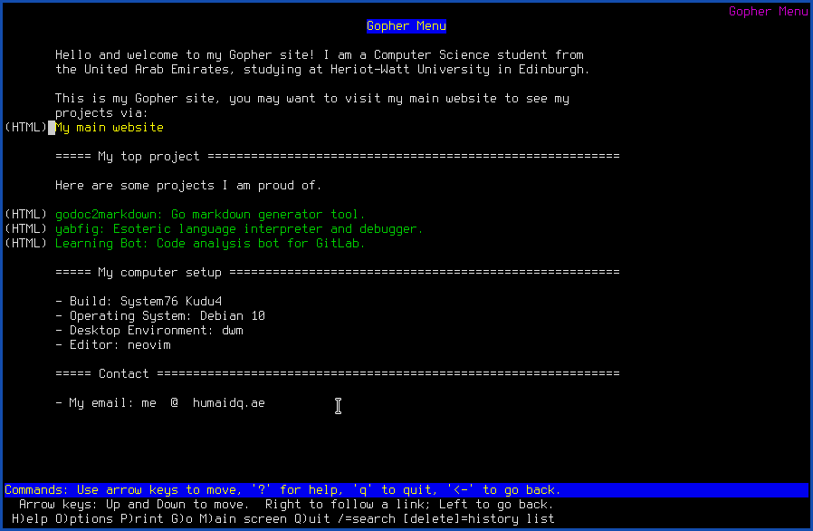

**Update:** The Gopher server is no longer running.

A Gopher version of my website is available! You can access it by visiting
<gopher://huma.id> with a browser that supports it, such as [lynx]. Or
alternatively, view the site with [Floodgap](https://gopher.floodgap.com/gopher/gw?huma.id)
on a modern browser. This is how it looks with lynx:

In the future, I may extend it to be a closer copy of my current website, and
to include the blog, projects, among other things.

[lynx]: https://lynx.browser.org/
