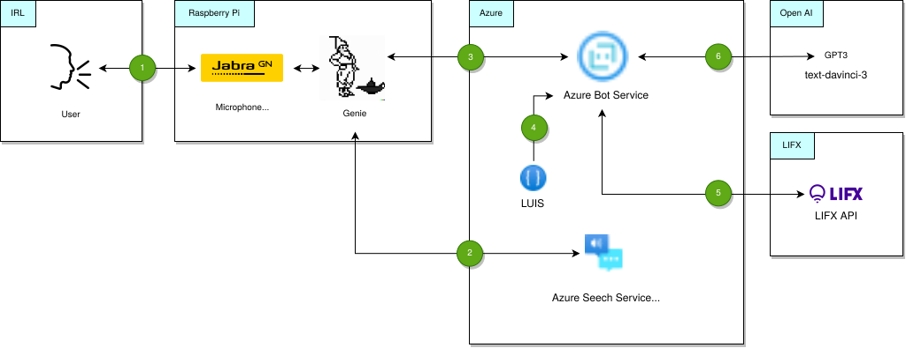
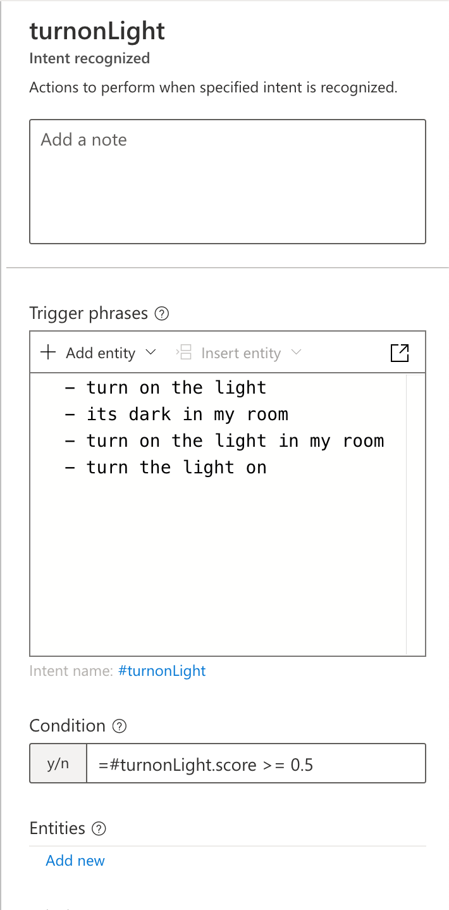
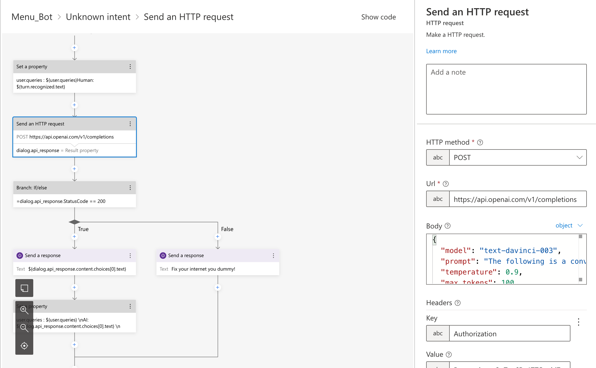

Me and my friend, Abdelrahman Ahmed Elkabbany
([GitHub](https://github.com/a9800),
[LinkedIn](https://www.linkedin.com/in/abdelrahman-ahmed-b28123170/)) were
looking for side projects to create using OpenAI’s advanced generative models.
Given all the buzz and virality of ChatGPT, we decided it would be a great idea
to create an at home personal assistant, similar to Alexa, but with the power
of GPT-3.

We have named this personal assistant Genie. Not only it would be able to
produce answers like GPT-3, but it would also be able to be expanded to control
smart devices.

We built this project using devices laying around, which was a Raspberry Pi 3B,
and a small Jabra speaker/microphone.

We initially created two parts for this system, a speech to text component, and
a text to speech component. We made a simple loop using the [Cognitive
Services Speech SDK](https://pypi.org/project/azure-cognitiveservices-speech/),
which echoed anything we said, this was the basis of our application. This
application ran on a Raspberry Pi 3B.

We wanted to use OpenAI's GPT-3 to create a personal assistant, but in addition
to that, we wanted to have our own programmable responses. We used the bot
framework using [LUIS](https://luis.ai) (Language Understanding) to recognise
intents, and creating our own dialog flows.

### A little bit of context

Azure Bot Framework provides a complete end-to-end solution for developing and
deploying conversational bots. Which is what we are using as the core of our
personal assistant.

Using dialog management with Azure Bot Service and LUIS, it works in the
following order:

1. The Azure Bot receives user input in form of text, using the Direct Line
   API.
2. The input is sent to LUIS, which identifies the user's intent (using NLP
   algorithms).
3. Based on the intent identified, the bot can trigger specific dialogs to
   continue the conversation.
4. The result is returned to the Raspberry Pi as text, then synthesized using
   the speech services. Watermarks are used to keep track of the conversation
   flow.

### Architecture Overview



1. User speaks to the genie program through a microphone.
2. Genie program calls the Cognitive Services SDK, which calls the Azure Speech
   Service, which transcribes the spoken text.
3. In case it recognises the "Hey Genie" phrase, it will forward the following
   prompt to the Azure Bot Service using the Direct Line API.
4. LUIS does intent recognition.
5. The Bot Service is able to interface with the LIFX smart bulbs using the
   LIFX API.
6. The Bot Service is able to call GPT-3 for chit-chats, knowledge queries,
   etc. While preserving conversation history.

The text response returned by Azure Bot Service is then synthesized using the
Speech Services, and relayed through the speaker.

### Intent Recognition

When LUIS identifies an intent we specify (such as `turnOnLight`, `checkTime`,
etc), it will trigger the appropriate pre-defined dialog. Hence, if the user
says "I am sleepy", LUIS would be able to identify this prompt should trigger
the `turnOffLight` dialog. This would then call the LIFX API, turning off the
smart bulb.

Here is an example of the `turnonLight` intent. The prompt doesn't need to
exactly match the utterances with the ones stated, as LUIS is able to infer
intentions using NLP and machine learning techniques.



On the other hand, if the user asks "How does quantum tunnelling work?", LUIS
would not recognise this intent, thus triggering the `unknownIntent` dialog.
This would forward the query to OpenAI's GPT-3 (using the text-danvinci-3
model, with our custom prompt). We also keep track of the previous prompts and
responses on the Bot Framework, so that GPT-3 has context of the conversation
history.

### Calling GPT-3 and preserving conversation history

We call GPT-3 whenever the unknown intent dialog is triggered. We also include
the previous prompts and responses in the request. Here is how the intent looks
on the Bot Framework.



We design the GPT-3 prompt so the language model can mimic a personal
assistant called Genie. Here is the prompt we used:

```
The following is a conversation with an AI assistant called Genie.
The assistant is helpful, creative, clever, and very friendly.

Human: Hello, who are you?
AI: I am an AI bot named Genie. How can I help you today?
${user.queries}
Human: ${turn.recognized.text}
AI:
```

Note that `${user.queries}` variable is a string which contains all the
previous questions and responses, so that it can keep the conversational flow.

### Demo

Here is a video demoing the setup: <https://youtu.be/pyhmaCWJn0o>

### Things we can improve

There are currently some delays in the system. Some of the delays are probably
due to the network overhead between the components and delays from the
components themselves (such as speech to text, and GPT-3). I'm sure there are
ways to further optimise this, but we got this working really well without
optimising

Another factor causing delays is how we currently detect the "Hey" phrase
using the Cognitive Services. We currently continuously run speech to text, and
detect the phrase from the transcription. This is not an ideal way to do it,
and it's also expensive, so this is probably something we want to perform
locally on the device.

Furthermore, we can utilise other features from Cognitive Services (such as
speaker identification), or LUIS (such as recognising entities, for example if
we want to set the bedroom lights to green).

With ChatGPT's expected official release as an API, it would be interesting to
include it with this project.

### Conclusion

OpenAI's GPT-3 is an impressive language model, and we'd hope to even better
language models. This article shows that you don't need to have a background in
artificial intelligence, or a massive budget to build a very impressive voice
assistant, that even beats existing assistants in the market -- all with
minimal programming.

We have released the code on GitHub under BSD 2-Clause license:
<https://github.com/humaidq/genie-assistant>

---

### Attributions

Microsoft icons used on diagrams in this post are licensed under these terms:

> Microsoft permits the use of these icons in architectural diagrams, training
> materials, or documentation. You may copy, distribute, and display the icons
> only for the permitted use unless granted explicit permission by Microsoft.
> Microsoft reserves all other rights.

The LIFX logo is a trademark of Feit Electric Company. The Jabra logo is a
trademark of GN Audio. The "Speak" icon is created by yut1655
([flaticon](https://www.flaticon.com/free-icon/speak_1247944), [terms of
use](https://www.freepikcompany.com/legal#nav-flaticon)). The "Genie" logo that
represents our program is generated by OpenAI's DALL-E 2.
