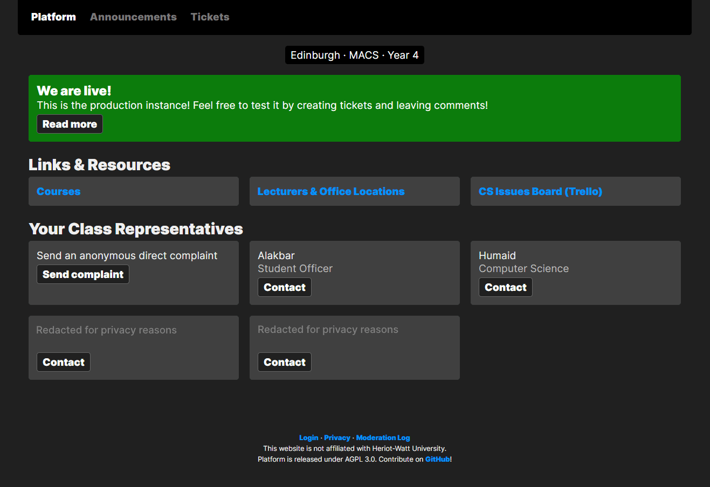

### 1. Description

This is a platform built by class representatives which allows students to post
tickets an complaints anonymously. This allows students to vote on issues, send
complaints to the representative in charge of the course they are having issues
with, and gives the class representatives a platform where they can publish
announcements in a semi-official way.

I had been a class representative at my university for a year already, and saw
the difficulties of collecting complaints and gauging student opinions on
issues.

So in collaboration with my fellow class representative
(now school officer) [Alakbar](https://alak.bar), we have built this platform
to make students' voices be heard while protecting their privacy. This is
especially important as the university is implementing the Responsive Blended
Learning approach in response to COVID-19.

In the next sub-sections, I'll explain the functionality of the different
features of the platform.

#### 1.1. The dashboard



The dashboard has a configurable alert, and links & resources section. It also
shows all the class representatives configured on the system.

Also, on the top of every page, it may be configured to state which class the
platform belongs to.

#### 1.2. Announcements

The announcements page allows class representatives to post semi-official
posts, which may be used for informing and updating students on decisions by
the university, or follow-ups regarding issues raised by the students.

Announcements supports tags, and show the date of when the announcement was
published, and it includes the duration since that date.

#### 1.3 Ticketing system

The ticketing system is what makes the platform particularly interesting. It
allows students to post complaints anonymously, and they may sort tickets based
on their degree or a specific course they may be taking.

Each user on the ticketing system is given a randomly generated name, which is
non-unique. This allows continuity with discussions, while preserving the
identity of the students. The system keeps track of their identity temporarily
with a session cookie.

Each ticket may be voted on one per user, this is however not linked with the
user's session. The system keeps track of upvotes by storing hashes of users IP
address, user agent, and a randomly generated pepper created at that instance.
This irreversable hash allows the system to keep track of upvotes without
storing user data.

The system is designed so that upvotes may not be linked with sessions, or the
complaints system explained next.

#### 1.4 Complaints system

The complaints system allows students to directly send an email to the
representatives which are involved with the course. This is useful especially
for people who want to contact the class representatives but do not want to
reveal their identity, or for those who don't know which representative to
contact regarding their specific issue.

After the student selects their course from a drop-down, and writes their
complaint, they may choose to include their email address if they do not wish
to be anonymous.

Once the student continues with sending their email, they will be asked to
confirm the list of recipients of the email, which are the representatives who
are involved in the course they have selected. This allows the student to know
who are the people who will be receiving the email if they proceed.

Also any message sent using the complaint system is not linked with any of the
posts or upvotes on the ticketing system, ensuring the privacy of the user.

#### 1.5. Moderation log

As inspired by [lobste.rs](https://lobste.rs), we have included a moderation
log to allow students to see the moderative actions done by the class
representatives. This is to increase transparency of the platform and gain the
trust of the students. Actions logged include:

- Resolving, deleting, or editing a ticket
- Removing an offending comment on a ticket
- Posting, editing, or deleting an announcement

Editing tickets includes a "from" and "to" comparison to what has been changed,
but this may be disabled in the case the edit was to remove personally
identifiable information. A reason also may be included for some edits.

The name of the moderator who applied the action is also listed.

#### 1.6. Online configurator

The system has an online configurator interface, which is a simple web editor
of a TOML file. This allows changing the links and alert on the main page, the
courses and degrees listed on the website, the class representatives, and
instance-related settings.

### 2. Requirements

The following packages must be installed on your system.

- Go _(tested with 1.14)_
- Git

### 3. Copying and contributing

This program is distributed under the AGPL 3.0 only license. This means if you
make your own fork of this app, you must release its source to its users under
the same license. You also need to disclose changes done to the software.

### 4. Downloading and running

```sh
$ git clone https://github.com/hw-cs-reps/platform
$ cd platform
$ go build
```

### 5. Setup & Usage

Running the web server will automatically generate a configuration file
(`config.toml`) if it is not yet created.

```sh
$ ./platform run
```

The program will exit when run for the first time, prompting you to configure
the program.
